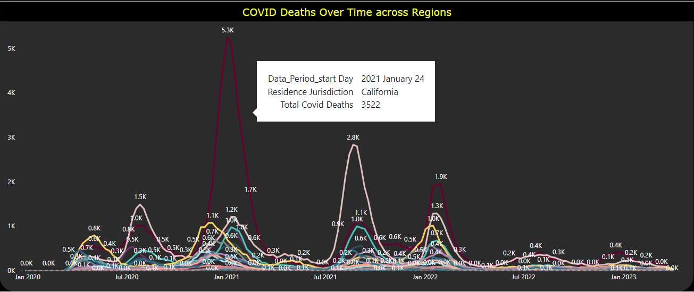
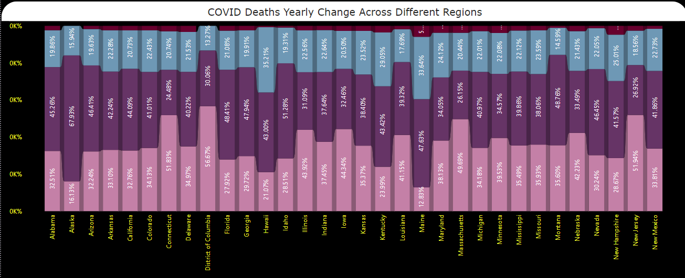
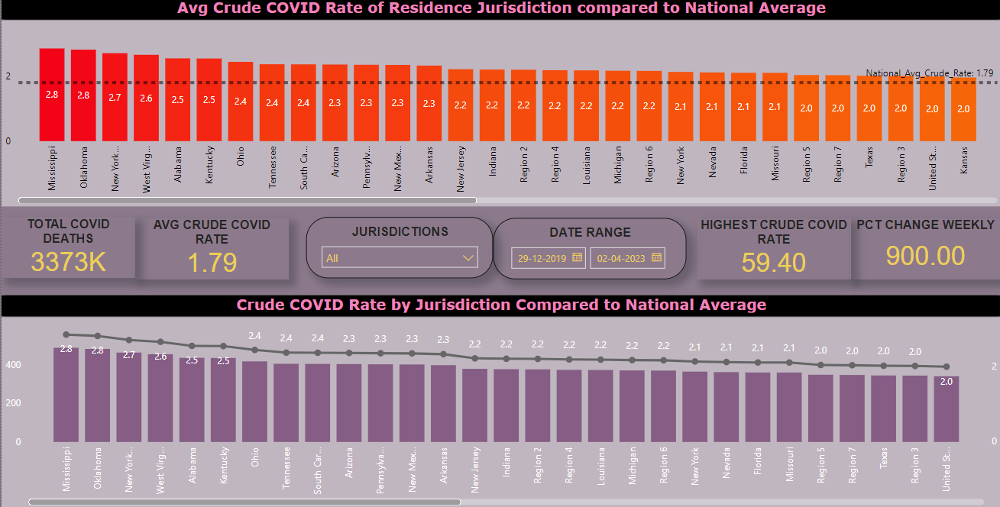
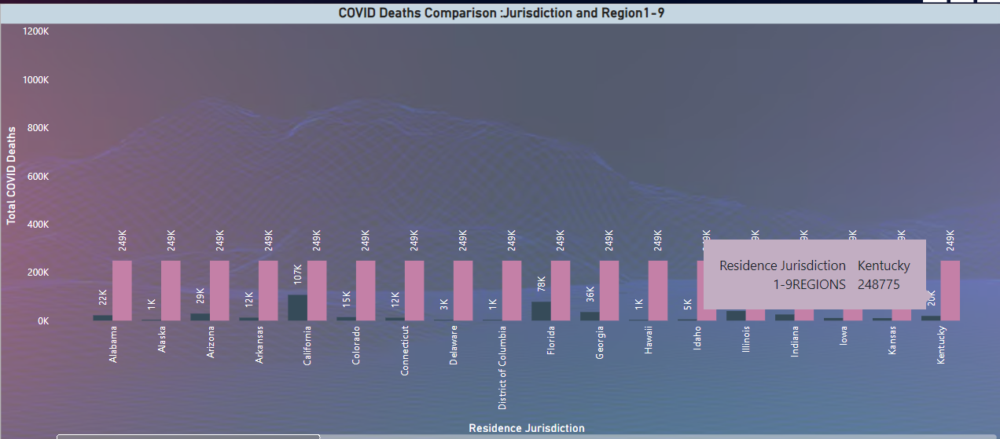
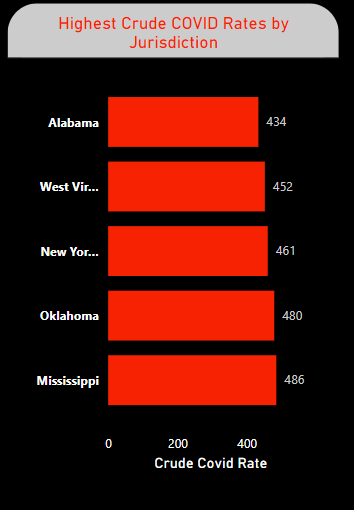
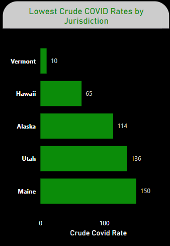

# Visualization Details

## 1. Line Chart: COVID Deaths Over Time Across Regions

**Description:**
    * This line chart visualizes the trend of COVID deaths over time across different regions.
    * The X-axis represents the timeline, ranging from January 2020 to January 2023.
    * The Y-axis shows the number of COVID deaths (in thousands).
    * Each line corresponds to a specific region, with peaks indicating significant increases in deaths during specific time periods.

**Key Features:**
    * Data labels highlight peak death counts for better interpretation.
    * A tooltip is displayed for specific data points (e.g., California on January 24, 2021, with 3,522 deaths).

## 2. Stacked Bar Chart: COVID Deaths Yearly Change Across Different Regions

**Description:**
    * This stacked bar chart illustrates the percentage change in COVID deaths on a yearly basis across different regions
    * Each bar represents a specific state or jurisdiction.
    * Different color segments within each bar represent the proportion of deaths across the years.

**Key Features:**
    * The chart helps compare how COVID deaths were distributed yearly across various regions.
    * Percentages are labeled within each bar for clear understanding.
    * Regions such as Connecticut and New Jersey have noticeable contributions in certain years.

## 3.Bar Chart: Crude COVID Rate by Jurisdiction Compared to National Average

**Description:**
    This bar chart compares the average crude COVID rates across jurisdictions against the national average.
    * The X-axis represents different jurisdictions, including states and regions (e.g., Mississippi, Oklahoma, Region 1–9).
    * The Y-axis measures the crude COVID rate, ranging from 0 to 3.

**Key Observations:**

   1. **National Average Crude Rate:** 1.79
   2. **Highest Crude COVID Rate:** 2.8 (Mississippi and Oklahoma).
   3. **Jurisdictions Above National Average:**
       - New York, West Virginia, Alabama, Kentucky, Ohio, and others exceeded the national rate.
   4. **Jurisdictions Matching or Below National Average:**   
       - Regions 5, 7, and 3; Texas; United States overall; and Kansas reported a crude COVID rate of 2.0 or lower.

**Key Features:**

   * Data labels clearly indicate the crude COVID rates for each jurisdiction.
   * A dashed line highlights the national average (1.79) for easy comparison.

## 4. Bar Chart: COVID Deaths Comparison by Jurisdiction and Region 1–9.

 **Description:**
   This bar chart visualizes the total COVID deaths across various jurisdictions and compares them to aggregated totals for Region 1–9 jurisdictions.
   * The X-axis represents residence jurisdictions, including states (e.g., Alabama, California, and Kentucky) and aggregated regions.
   * The Y-axis measures total COVID deaths, ranging from 0K to 1200K.

 **Key Observations:**

 1.**Region 1–9 Jurisdictions:**
    * The total COVID deaths for Region 1–9 jurisdictions is prominently displayed for Kentucky (248,775 deaths), emphasizing their significant contribution.
 2. **State-level Trends:**
    * States such as **California**, **Florida** and others exhibit relatively high total COVID deaths (~249K each).
    * Smaller jurisdictions like **Hawaii**, **Delaware** and **Alaska** report much lower COVID deaths (1K–5K).
 3. **Comparative Trends:**
    * Kentucky stands out with a death count of approximately 248,775, aligning closely with aggregated regional values (Region 1–9)
    * States like Arkansas and District of Columbia display noticeably lower counts (~107K and 78K, respectively).

  **Key Features:**

   * The chart includes **data labels** for precise death counts.
   * Jurisdictions with lower death tolls appear with shorter bars, providing a clear visual contrast.
   * A tooltip highlights critical data points (e.g., **Kentucky – 248,775 deaths**).

## 5. Clustered Bar Charts: Highest and Lowest Crude COVID Rates

**Description:**
   These visuals illustrate the jurisdictions with the highest and lowest crude COVID rates, helping  identify regions that performed notably well or poorly relative to others.

  ### 1. Highest Crude COVID Rates:
   * The X-axis measures the crude COVID rates.represents jurisdictions with the highest rates.
   * The Y-axis represents jurisdictions with the highest rates.
   * **Key Observations:**
      * Alabama and West Virginia report the highest crude COVID rates at 434 and 486 respectively.
      * States like New York, Oklahoma and Mississippi follow closely with rates between 465 and 450.

  ### 2. Lowest Crude COVID Rates:
   * The X-axis measures the crude COVID rates.
    * The Y-axis represents jurisdictions with the lowest rates.
    * **Key Observations:**
       * Vermont and Hawaii report the lowest crude COVID rates at 10 and 65 respectively.
       * States like Alaska, utah and maine follow with rates between 114 and 150.

   **Key Features:**
    * Each bar chart focuses on specific segments (highest vs. lowest jurisdictions) for clarity.
    * Data labels are included to highlight precise crude COVID rates.
    * The visuals effectively contrast high-risk and low-risk jurisdictions.

## Conclusion
These findings emphasize the need for targeted interventions in high-crude-rate regions and further analysis to understand factors contributing to lower rates in better-performing jurisdictions.
